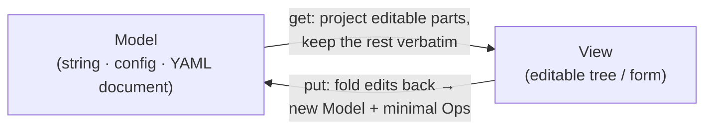
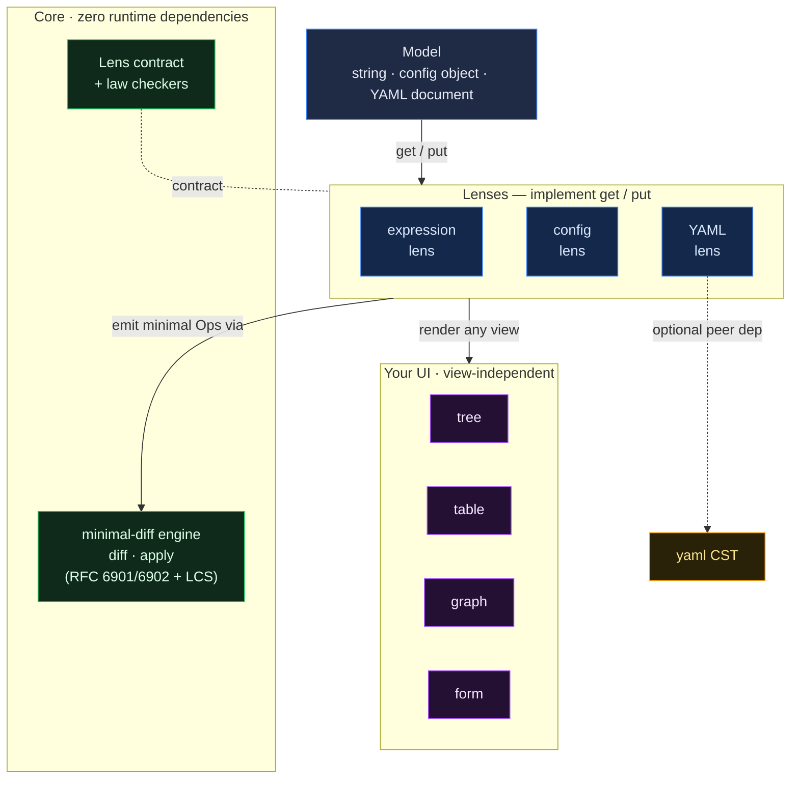

# reweave

[](https://github.com/WinexWolf/reweave/actions/workflows/ci.yml)
[](./LICENSE)

**Lossless partial editing for structured documents.** Edit a friendly
projection of a document, get back a **minimal diff**, and keep everything the
editor doesn't model — **verbatim**.

<p align="center"><em>edit a projection → get a minimal patch → nothing you didn't touch ever changes</em></p>

```ts
import { exprLens } from "reweave";

const source = 'country == "US" AND geo.near(hq, 50km) AND plan == "free"';

// 1. Project the string into an editable tree. The vendor accessor the editor
//    can't model becomes a `raw` leaf — carried through untouched.
const view = exprLens.get(source);

// 2. Edit the tree like plain data.
view.nodes[2].value = "pro";

// 3. Fold it back: you get the new source AND the minimal operation log.
const { model, ops } = exprLens.put(source, view);

model; // 'country == "US" AND geo.near(hq, 50km) AND plan == "pro"'
ops;   // [{ op: "replace", path: "/nodes/2/value", value: "pro", prev: "free" }]
//        ↑ one operation. geo.near(...) was never parsed, never rewritten.
```

---

## The problem

Every visual editor over a structured artifact — a rule builder, a config form,
a low-code canvas — hits the same three problems **at once**:

1. **Partial projection.** The UI only models *part* of the document. It must
   not clobber the rest.
2. **Verbatim preservation.** Real documents contain constructs the editor
   doesn't understand — vendor functions, regexes, YAML comments, keys from a
   newer schema. These must survive a round-trip **byte-for-byte**.
3. **Minimal diffs.** Saving should produce a small, reviewable patch — not a
   full rewrite — so changes are auditable and safe under optimistic concurrency.

Most tools solve one and quietly break the others. The classic tell: open a
config file in a GUI, change one field, hit save — and watch it reformat the
whole file and drop your comments. `reweave` solves all three, and makes
correctness a **checkable property**, not a promise.

## The idea: practical bidirectional lenses

A **lens** is a pair of transformations between a stored `Model` (a string, a
config object, a document) and an editable `View`:

```
get : Model → View                 project the editable view
put : (Model, View) → Model + Ops  fold an edited view back into the model
```

This is the bidirectional-transformation model from the programming-languages
literature (Foster et al., *Combinators for Bidirectional Tree Transformations*).
`reweave` keeps the two round-trip **laws** and adds the parts real tooling needs
but the theory leaves out.

| Round-trip law | Meaning | Enforced by |
| --- | --- | --- |
| **GetPut** — `put(m, get(m))` is a no-op | *Opening and saving without edits changes nothing* | property tests |
| **PutGet** — `get(put(m, v)) == v` | *What you see is what you saved* | property tests |



**The original contribution is the combination**, not any single piece: partial
projection **+** verbatim preservation of unrepresentable regions **+** minimal
semantic diff generation, all under provable round-trip laws.

- Textbook lenses don't emit an edit/patch log.
- [JSON Patch (RFC 6902)](https://datatracker.ietf.org/doc/html/rfc6902) is the
  *output format* here, not the mechanism.
- Projectional editors (e.g. JetBrains MPS) are heavyweight and not diff-oriented.

## Where you'd use it

Anywhere a GUI edits *part* of a document that also holds hand-authored or
advanced content, and every change must be small and auditable:

| Domain | Why reweave fits |
| --- | --- |
| **CI/CD & infra config GUIs** (GitHub Actions, Helm, Terraform, k8s) | Edit a subset in a form; keep comments and unknown keys; emit a PR-able minimal diff. → the [YAML lens](#3-the-yaml-lens--comment-preserving). |
| **Feature-flag / experiment targeting** (LaunchDarkly-style) | Visual rule builder that must not drop custom segment expressions; minimal audit diffs. |
| **Authorization / access policies** (IAM, Cedar, OPA) | Edit part of a policy in a UI, preserve advanced conditions verbatim, produce reviewable security diffs. |
| **Low-code / workflow builders** (n8n, Retool, Zapier) | Visual editor over a JSON workflow that round-trips hand-authored advanced steps. |
| **Alerting / monitoring rules** (Prometheus, Grafana) | Visual editing over expressions with preserved raw predicates. |
| **Search / analytics query builders** | Visual filters that preserve advanced raw query fragments. |
| **CMS structured content** | Edit known blocks, preserve custom embeds the editor doesn't render. |
| **Compliance / policy authoring** | Where losing an un-modeled clause is unacceptable and every change must be auditable. |
| **Optimistic-concurrency editing** | Every op carries `prev`, so a backend can reject a patch if the stored value drifted. |

## What's in the box

### 1. A minimal-diff engine

```ts
import { diff, apply } from "reweave";

diff({ rules: [{ v: 1 }, { v: 2 }] }, { rules: [{ v: 1 }, { v: 9 }] });
// [{ op: "replace", path: "/rules/1/v", value: 9, prev: 2 }]
//   ↑ one deep replace — not a rewrite of the whole array
```

RFC 6901 pointers, RFC 6902-style ops, LCS-based array diffing (insert one
element without churning its neighbours), and `prev` on every op for optimistic
concurrency. Law: `apply(a, diff(a, b))` deep-equals `b`.

### 2. The expression lens (flagship)

A **total** parser for a boolean targeting language (`AND`/`OR`/`NOT`,
comparisons, `in [...]`, grouping). Anything it can't structure —
`geo.near(hq, 50km)`, `matches(email, /@corp/)` — becomes a `raw` node and
round-trips exactly.

```ts
import { parse, serialize } from "reweave";

parse('tier in ["gold", "plat"] OR spend > 10000');
// or[ compare(tier in [...]), compare(spend > 10000) ]
```

### 3. The YAML lens — comment-preserving

The adapter people feel. Edit `values.yaml` / a GitHub Actions file through a
form and get back a minimal diff with **every comment, key order, and quoting
style intact**. Built on the [`yaml`](https://github.com/eemeli/yaml) CST and
applied surgically — untouched lines are never re-emitted.

```ts
import { yamlLens } from "reweave/yaml";

const source = `# Deployment config
name: acme-api        # the service name
replicas: 3
resources:
  cpu: "500m"         # tuned for prod
`;

const lens = yamlLens();
const view = lens.get(source);          // { name, replicas, resources: {...} }
view.resources.cpu = "750m";

const { model, ops } = lens.put(source, view);
// ops:   [{ op: "replace", path: "/resources/cpu", value: "750m", prev: "500m" }]
// model: the same file, `cpu: "750m"`, EVERY comment still there.
```

A no-op save returns the source **byte-for-byte** — reweave never reformats a
file you didn't actually change.

> `reweave/yaml` needs the peer dependency `yaml` (>= 2). The core `reweave`
> entry point has **zero runtime dependencies**.

### 4. The config lens (partial projection)

Declare the keys the editor owns; every other key is preserved verbatim.

```ts
import { configLens } from "reweave";

const lens = configLens(["name", "version"]);
const { ops } = lens.put(pkg, { ...lens.get(pkg), version: "2.4.0" });
// scripts, custom tool config, unknown future fields — all untouched
```

## Playground

An interactive demo with two modes:

- **Targeting rules** — the same rule rendered as a **tree**, a **table**, and a
  **node graph**. Edit in any view; the serialized output and minimal patch
  update identically. *One lens, many views.*
- **YAML config** — edit an annotated `values.yaml` through a form and watch the
  comments survive and the patch stay minimal.

```bash
cd playground
npm install
npm run dev
```

Live demo: **(https://winexwolf.github.io/reweave/)** (deploys from `playground/` via CI).

## Install

```bash
npm install reweave              # core — zero runtime dependencies
npm install yaml                 # only if you use reweave/yaml
```

Ships ESM + type declarations.

## API

```ts
// core
diff(a, b): Op[]                      // minimal patch turning a into b
apply(doc, ops): Json                // apply a patch (pure)
deepEqual(a, b): boolean

// lens contract
interface Lens<M, V> {
  get(model: M): V;
  put(model: M, view: V): { model: M; ops: Op[] };
}
holdsGetPut(lens, model): boolean     // law checkers, handy in your own tests
holdsPutGet(lens, model, view): boolean

// expression lens
parse(source): Expr                   // total; unparseable leaves → { type: "raw" }
serialize(expr): string
exprLens: Lens<string, Expr>

// config + yaml lenses
configLens(editableKeys): Lens<object, object>
yamlLens(options?): Lens<string, object>   // from "reweave/yaml"
```

## Correctness

The laws aren't prose — they're 1,000+ generated cases per run via
[`fast-check`](https://github.com/dubzzz/fast-check):

```bash
npm test
```

- `apply(a, diff(a, b))` deep-equals `b` over random JSON
- `parse(serialize(ast))` deep-equals `ast`; `serialize` is idempotent
- `GetPut` / `PutGet` hold for every lens over generated inputs
- YAML: a no-op save returns the source unchanged; edits preserve comments

## Architecture

A tiny pure core (`diff`/`apply` + the lens contract) with adapters plugged in.
The core knows nothing about expressions, YAML, or your UI; lenses depend on the
core; your views depend only on the lens contract — so the same model can be
rendered as a tree, a table, a graph, or a form and every edit round-trips the
same way.



```
reweave/
├─ src/
│  ├─ ops.ts        # minimal-diff engine (RFC 6901/6902 + LCS)
│  ├─ lens.ts       # Lens contract + law checkers
│  ├─ expr/         # boolean-expression lens (parser · serializer · lens)
│  ├─ json/         # partial-projection config lens
│  └─ yaml/         # comment-preserving YAML lens (peer dep: yaml)
├─ test/            # unit + property-based tests
└─ playground/      # Vite + React demo (rules: 3 views · YAML)
```

Add your own lens by implementing `get`/`put` and proving the laws with the
provided checkers — see [CONTRIBUTING.md](./CONTRIBUTING.md).

## Roadmap

- [ ] Keyed array diffing (`id`-stable reorders)
- [ ] Op inversion (`invert(op)`) for undo
- [ ] TOML / JSON5 comment-preserving lenses
- [ ] Pluggable grammars for the expression lens

## License

MIT © Anukriti Jaiswal
